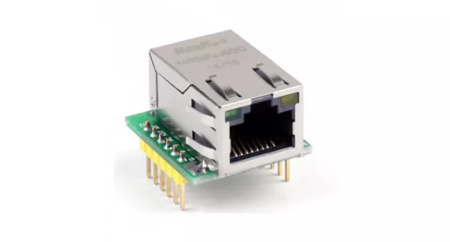

# Integrated Ethernet Connectivity (W5500-MIN)



## Overview
Powering the GatewayMe's primary connection to the internet is the **W5500-MIN** module. This compact breakout board features the Wiznet W5500 Hardwired TCP/IP embedded Ethernet controller, providing a stable, high-speed SPI backhaul for sensor data.

## Hardware Specifications
- **Module**: W5500-MIN Breakout
- **Controller**: Wiznet W5500
- **Interface**: SPI (Serial Peripheral Interface)
- **Buffer**: 32KB Internal Tx/Rx Buffer
- **Speed**: 10/100 Mbps (Ethernet), up to 80MHz (SPI)

### Electrical Specifications
| Parameter | Min | Typical | Max | Unit |
| :--- | :--- | :--- | :--- | :--- |
| Supply Voltage (3.3V) | 2.97 | 3.3 | 3.63 | V |
| Logic Level (SPI) | - | 3.3 | - | V |
| Operating Current (TX) | - | 132 | - | mA |
| Operating Current (RX) | - | 87 | - | mA |

## Interface
The module communicates with the Mesh Controller via a standard 4-wire SPI interface + Chip Select and Reset.

### Connection Diagram
```text
+-----------------------+                    +-----------------------+
|    Mesh Controller    |                    |   W5500-MIN Module    |
|      (GatewayMe)      |                    |      (Ethernet)       |
|                       |                    |                       |
|   [ 3.3V Out ] ----------------------------> [ 3.3V ]              |
|                       |                    |                       |
|   [   GND    ] ----------------------------> [ GND  ]              |
|                       |                    |                       |
|   [ SPI MOSI ] ----------------------------> [ MOSI ]              |
|                       |                    |                       |
|   [ SPI MISO ] <---------------------------- [ MISO ]              |
|                       |                    |                       |
|   [ SPI SCK  ] ----------------------------> [ SCLK ]              |
|                       |                    |                       |
|   [  CS Pin  ] ----------------------------> [ SCS  ]              |
|                       |                    |                       |
|   [ RST Pin  ] ----------------------------> [ RST  ]              |
+-----------------------+                    +-----------------------+
```
*Note: The W5500 supports 3.3V logic. 5V tolerant inputs are NOT guaranteed, use level shifters if connecting to a 5V MCU.*
