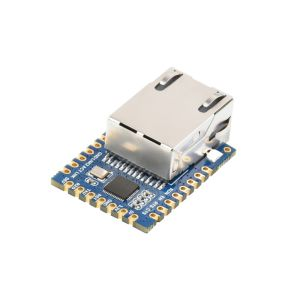

# Integrated Ethernet Connectivity (Waveshare UART TO ETH)



## Overview
The GatewayMe utilizes the **Waveshare UART TO ETH** module to provide a seamless, transparent bridge between the mesh network's serial data and the internet. Unlike SPI-based solutions, this module handles the full TCP/IP stack internally, treating the Ethernet connection as a simple UART stream for the main controller.

## Hardware Specifications
- **Module**: Waveshare UART TO ETH (Mini)
- **Processor**: 32-bit ARM Cortex-M0 series
- **Interface**: UART (TTL)
- **Ethernet**: 10/100 Mbps Auto-MDI/MDIX
- **Protocols**: TCP Server/Client, UDP Server/Client, HTTPD Client
- **Configuration**: Web Browser, AT Commands, or Serial Config Tool

### Electrical Specifications
| Parameter | Min | Typical | Max | Unit |
| :--- | :--- | :--- | :--- | :--- |
| Supply Voltage | 3.0 | 3.3 / 5.0 | 5.5 | V |
| Logic Level | - | 3.3 (5V Tolerant) | - | V |
| Operating Current | - | 140 | - | mA |
| Baud Rate | 600 | 115200 | 460800 | bps |

## Interface
The module connects directly to the Gateway Controller's UART pins, simplifying the architecture to a true "Serial-to-Ethernet" bridge.

### Connection Diagram
```text
+-----------------------+                    +-----------------------+
|    Mesh Controller    |                    | Waveshare UART TO ETH |
|      (GatewayMe)      |                    |      (S2E Module)     |
|                       |                    |                       |
|   [ VCC (3.3V/5V) ] -----------------------> [ VCC  ]              |
|                       |                    |                       |
|   [      GND      ] -----------------------> [ GND  ]              |
|                       |                    |                       |
|   [    UART TX    ] -----------------------> [ RXD  ]              |
|                       |                    |                       |
|   [    UART RX    ] <----------------------- [ TXD  ]              |
|                       |                    |                       |
|   [   RST (Opt)   ] -----------------------> [ RST  ]              |
+-----------------------+                    +-----------------------+
```
*Note: Config pins (CFG) can be pulled low to enter configuration mode if web configuration is unavailable.*

## Work Modes
1.  **TCP Client (Default)**: Gateway connects to a central cloud server IP. Data sent to UART is forwarded to the server; server responses appear on UART.
2.  **UDP Mode**: Fire-and-forget packets for low-latency telemetry.
3.  **HTTPD Client**: Encapsulates data into HTTP POST/GET requests (useful for REST APIs).
