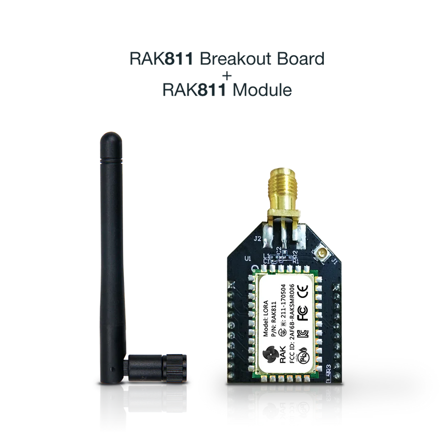
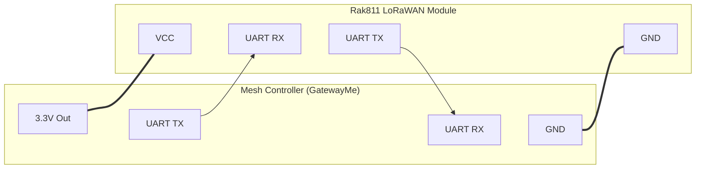

# LoRaWAN Connectivity Module (Rak811)

## Overview
This swappable module provides LoRaWAN connectivity using the **Rak811** modem. It enables the GatewayMe to act as a LoRaWAN end-device, bridging the local mesh network to a LoRaWAN Network Server (LNS) like The Things Network (TTN) or Helium.

## Hardware Specifications
- **Module**: Rak Wireless Rak811
- **Core Components**: STM32L151 (MCU) + Semtech SX1276 (LoRa Transceiver)
- **Protocol**: LoRaWAN 1.0.2 / 1.0.3 support
- **Frequency Support**: Global bands (EU868, US915, AU915, etc.)
- **Sensitivity**: Down to -148dBm

### Electrical Specifications
| Parameter | Min | Typical | Max | Unit |
| :--- | :--- | :--- | :--- | :--- |
| Supply Voltage (VCC) | 3.2 | 3.3 | 3.6 | V |
| Logic Level (UART) | - | 3.3 | - | V |
| TX Current | - | 120 | - | mA |
| RX Current | - | 15 | - | mA |
| Sleep Current | - | 1 | - | uA |

> [!WARNING]
> The Rak811 operates at **3.3V logic**. Do not connect directly to 5V systems without a logic level converter.

## Interface
The module communicates with the Mesh Controller via a standard UART interface.

### Connection Diagram

- **Baud Rate**: 115200 bps (default)
- **Data Bits**: 8
- **Stop Bits**: 1
- **Parity**: None

## How It Works
The GatewayMe controller communicates with the Rak811 via **AT Commands** over the UART interface. The gateway encapsulates sensor data into LoRaWAN payloads and instructs the Rak811 to transmit them.

### Operational Workflow
1.  **Configuration**: The Gateway sends commands to set the LoRaWAN region, keys (AppEUI, AppKey), and work mode.
2.  **Joining**: The module performs an OTAA (Over-The-Air Activation) join request to the network server.
3.  **Data Transmission**: Once joined, the Gateway sends binary payloads using the `at+send` command.
4.  **Downlink**: The Rak811 listens for downlink messages from the LNS in RX windows and forwards them to the Gateway via UART.

## AT Command List
The following is a comprehensive list of commonly used AT commands for the Rak811.

### General Commands
| Command | Description |
| :--- | :--- |
| `at+version` | Get firmware version |
| `at+get_config=device:status` | Get device status (work mode, join status, etc.) |
| `at+set_config=device:restart` | Reset the module |
| `at+set_config=device:sleep:1` | Enter sleep mode |

### LoRaWAN Configuration
| Command | Description |
| :--- | :--- |
| `at+set_config=lora:work_mode:0` | Set to LoRaWAN mode (0) or P2P mode (1) |
| `at+set_config=lora:region:EU868` | Set LoRaWAN region (e.g., EU868, US915) |
| `at+set_config=lora:class:0` | Set class (0: Class A, 1: Class B, 2: Class C) |
| `at+set_config=lora:join_mode:0` | Set join mode (0: OTAA, 1: ABP) |
| `at+set_config=lora:dev_eui:XXXX` | Set Device EUI (16 hex chars) |
| `at+set_config=lora:app_eui:XXXX` | Set Application EUI (16 hex chars) |
| `at+set_config=lora:app_key:XXXX` | Set Application Key (32 hex chars) |
| `at+set_config=lora:adr:1` | Enable Adaptive Data Rate (ADR) |
| `at+set_config=lora:dr:5` | Set Data Rate (if ADR is off) |

### Network Operations
| Command | Description |
| :--- | :--- |
| `at+join` | Join the network (OTAA) |
| `at+send=lora:1:AABBCC` | Send hex data `AABBCC` on port 1 (Unconfirmed) |
| `at+send=lora:1:AABBCC:1` | Send hex data `AABBCC` on port 1 (Confirmed) |
| `at+recv=lora:0:0` | Logic to receive data (handled by UART callback) |

### P2P Mode (Optional)
| Command | Description |
| :--- | :--- |
| `at+set_config=lora:work_mode:1` | Switch to LoRa P2P mode |
| `at+set_config=lorap2p:transfer_mode:2` | Set P2P transfer mode |
| `at+send=lorap2p:AABBCC` | Send P2P packet |
