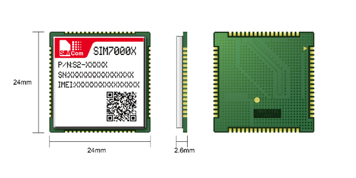

# NB-IoT Connectivity Module (SIM7000)



## Overview
This swappable module provides Narrowband IoT (NB-IoT) and LTE-M connectivity using the **SIMCom SIM7000** series modem. It also offers integrated GNSS (GPS/GLONASS) capabilities. This allows the GatewayMe to communicate with cloud backends via cellular networks, suitable for moving gateways or locations without Ethernet/LoRaWAN coverage.

## Hardware Specifications
- **Module**: SIMCom SIM7000 (SIM7000A/C/E/G depending on region)
- **Tech**: LTE CAT-M1 / NB-IoT / GNSS
- **GNSS**: GPS, GLONASS, BeiDou, Galileo
- **Antenna Connectors**: 
  - Main: LTE Antenna (SMA)
  - GNSS: Active GPS Antenna (IPEX/SMA)

### RF Specifications
| Feature | Details |
| :--- | :--- |
| Frequency Bands | B1/B3/B5/B8/B20/B28 (Global support varies by sub-model) |
| Output Power | 23 dBm +/- 2.7dB (Class 3) |
| Sensitivity | -129 dBm (NB-IoT) / -107 dBm (CAT-M1) |

### Electrical Specifications
| Parameter | Min | Typical | Max | Unit |
| :--- | :--- | :--- | :--- | :--- |
| Supply Voltage (VBAT) | 3.4 | 3.8 | 4.4 | V |
| Logic Level (UART) | - | 1.8 | - | V |
| Peak Current | - | - | 2.0 | A |
| Sleep Current | - | 1.2 | - | mA |

> [!CAUTION]
> The SIM7000 native logic level is **1.8V**. GatewayMe must use a **Voltage Level Translator** to interface with 3.3V MCUs. Power supply traces must handle **2A bursts**.

## Interface
The module communicates with the Mesh Controller via a standard UART interface.

### Connection Diagram
```text
+-----------------------+                    +-----------------------+
|    Mesh Controller    |                    |    SIM7000 Module     |
|      (GatewayMe)      |                    |     (NB-IoT/LTE)      |
|                       |                    |                       |
|   [ 3.8V/VCC ] ----------------------------> [ VBAT ]              |
|                       |                    |                       |
|   [ UART TX  ] ----------------------------> [ UART RX ]           |
|                       |                    |                       |
|   [ UART RX  ] <---------------------------- [ UART TX ]           |
|                       |                    |                       |
|   [   GND    ] ----------------------------> [ GND ]               |
+-----------------------+                    +-----------------------+
```
*Note: Ensure common ground and appropriate level shifting on UART lines.*

## How It Works
The GatewayMe controller communicates with the SIM7000 via **AT Commands**.

### Key AT Commands
| Command | Description |
| :--- | :--- |
| `AT` | Test communication |
| `AT+CPIN?` | Check SIM card status |
| `AT+CSQ` | Check signal quality |
| `AT+CREG?` | Check network registration status |
| `AT+CGATT?` | Check GPRS attachment status |
| `AT+CNACT=1,"APN"` | Activate network with APN |
| `AT+SMCONF="URL",...`| Configure MQTT settings |
| `AT+SMCONN` | Connect to MQTT broker |
| `AT+SMPUB` | Publish MQTT message |
