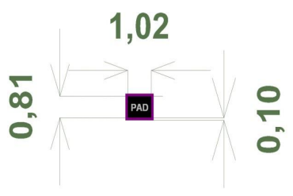

# Mesh Network

## Overview
The Mesh Network is a low-power, long-range communication protocol that allows the sensor nodes to communicate with each other and with the Gateway. It is built on the LoRa protocol and is designed to work in harsh environments.

## Hardware Specification
- **MCU**: to be announced
- **Radio**: LoRa / RF coordinate module (SMA Antenna connector)
- **Power**: battery powered

## Features
- **Low Power**: Optimized for long battery life
- **Long Range**: Capable of communicating over long distances
- **Mesh Networking**: Allows sensor nodes to communicate with each other and with the Gateway
- **Battery Powered**: Can be deployed in remote locations without access to power

## Footprint

The suggested footprint consists in 31 LGA pads positioned as following

Notes:
- The area underneath the module must be kept free of components (both top
and bottom layers) and must be covered with solder resist.
- The PCB top layer underneath the module must be free of nets, power planes
and vias.
- The module power supply must be as clean as possible. It must be decoupled
placing a ceramic capacitor as near as possible to the Vcc pins. Additional
filtering made by a ferrite bead is recommended.
- Noisy electronic components (such as switching power supply) must be
placed as far as possible and adequately decoupled.
- The ground pins of the module shall be connected to a solid ground plane.

## Module pinout

|Number |Pin Name| Type| Description|
|-----|-----|----|-----|
|1| GND1 |GND |Ground|
|2| GND2 |GND |Ground|
|3| BOOT0 |Not functional |Not functional|
|4| VCC |Power Input |Supply voltage|
|5| PA4 |Digital I/O |I/O|
|6| PA3 |Digital I/O |I/O|
|7| DEBUG_CLK |Not functional |Not functional|
|8| DEBUG_DATA |Not functional |Not functional|
|9| VCC |Power Input |Supply voltage|
|10| GND3 |GND |Ground|
|11| PB6_I2C_SCL |Not functional |Not functional|
|12| PB7_I2C_SDA |Not functional |Not functional|
|13| PA12_SPI_MOSI |Not functional |Not functional|
|14| PA11_SPI_MISO |Not functional |Not functional|
|15| PA1_SPI_SCK |Not functional |Not functional|
|16| PB10_SPI_NSS |Not functional |Not functional|
|17| LR_IRQ |Not functional |Not functional|
|18| PB0 |Not functional |Not functional|
|19| GND4 |GND |Ground|
|20| VCC |Power Input |Supply voltage|
|21| PB1_UART_RTS |Digital Output |AAPI UART CTS|
|22| PA6_UART_CTS |Not functional |Not Functional|
|23| PA5_UART_TX |Digital Output |AAPI / SAPI UART TX|
|24| PA7_UART_RX| Digital Input |AAPI / SAPI UART RX|
|25| VCC| Power Input| Supply voltage|
|26| PA0_ADC| Not functional |Not functional|
|27| NRESET| Reset input |System reset input (active low)|
|28| GND5 |GND| Ground|
|29| GND6| GND| Ground|
|30| RF_SIG| RF| RF sub-GHz input/output|
|31| GND7 |GND| Ground|

## Electrical characteristic

### Absolute Maximum Ratings

|Parameter |Value| Unit|
|---|---|---|
|Power Supply Voltage |+3.6 |V|
|Voltage on any pin |+3.6 |V|
|Rf input power (Pmax) |0 |dBm|
|Storage Temp. Range |-40 ~ +85 |ºC|

### Operating Conditions

|Parameter |Min |Max |Unit|
|---|---|---|---|
|Power Supply Voltage (Vcc) |+2.5 |+3.3 |V|
|Operating Temperature range |-40 |+85 |°C|
|Logic Input Low Voltage Vss |0.3*Vcc |V|
|Logic Input High Voltage |0.7*Vcc |Vcc |V|
|Logic Output Low Level Vss |Vss |+ 0.45 |V|
|Logic Output High Level |Vcc-0.45 |Vcc |V|

### Power Consumption

|Mode |Typ. value |Unit|
|---|---|---|
|Transmit @+11.5 dBm (2.4 GHz)|23 |mA|
|Transmit @+14 dBm (868 MHz)|27 |mA|
|Transmit @+22 dBm (915 MHz)|124 |mA|
|Receive (2.4 GHz)|7 |mA|
|Receive (868 MHz)|6 |mA|

### RF characteristics

|Condition |Min. |Typ. |Max. |Unit|
|----------|-----|-----|-----|------|
|RF Frequency range (sub-GHz)| 150 | | 928 |MHz|
|Frequency tolerance | | ±10 | | ppm|
|Programmable Output Power Range (LPA)|-17| | +13 |dBm|
|Programmable Output Power Range (HPA)|-9| | +20 |dBm|
|RF Data Rate LoRa®| 0.292|| 101.5 |kbps|
|RX sensitivity SF7; BW=125 KHz|| -118| dBm|
|RX sensitivity SF12; BW=125 KHz|| -132.5| dBm|
|RX sensitivity SF7; BW=250 KHz|| -116| dBm|
|RX sensitivity SF12; BW=250 KHz|| -130| dBm|
|RX sensitivity SF7; BW=500 KHz|| -112 |dBm|
|RX sensitivity SF12; BW=500 KHz|| -124.5| dBm|
|RF Frequency range (2.4 GHz)| 2400|| 2485| MHz|
|Frequency tolerance|| ±10| ppm|
|Programmable Output Power Range (LPA)|-17|| +10.5| dBm|
|RF Data Rate LoRa®| 0.292|| 101.5| kbps|
|Rx sensitivity SF5; BW=406 KHz ||-111| dBm|
|RX sensitivity SF7; BW=406 KHz||-129|dBm|
|RX sensitivity SF5; BW=812 KHz|| -108| dBm|
|RX sensitivity SF7; BW=812 KHz ||-112 |dBm|

