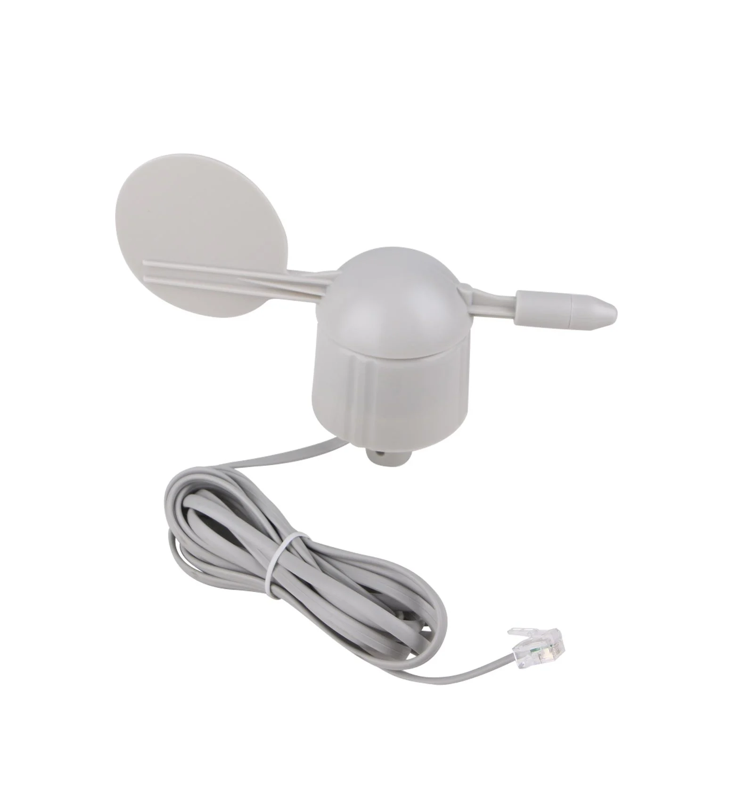
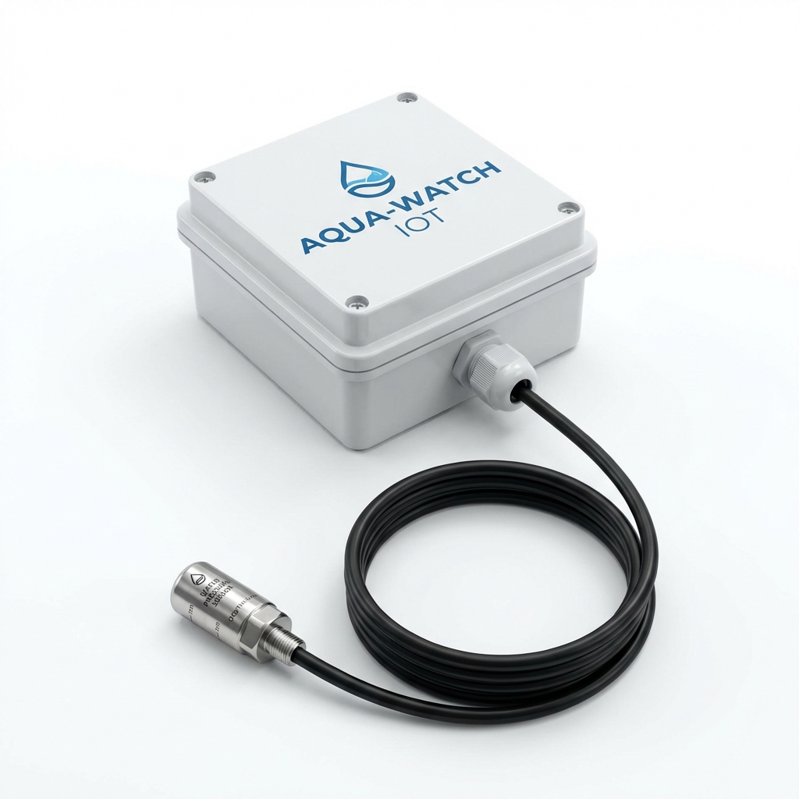
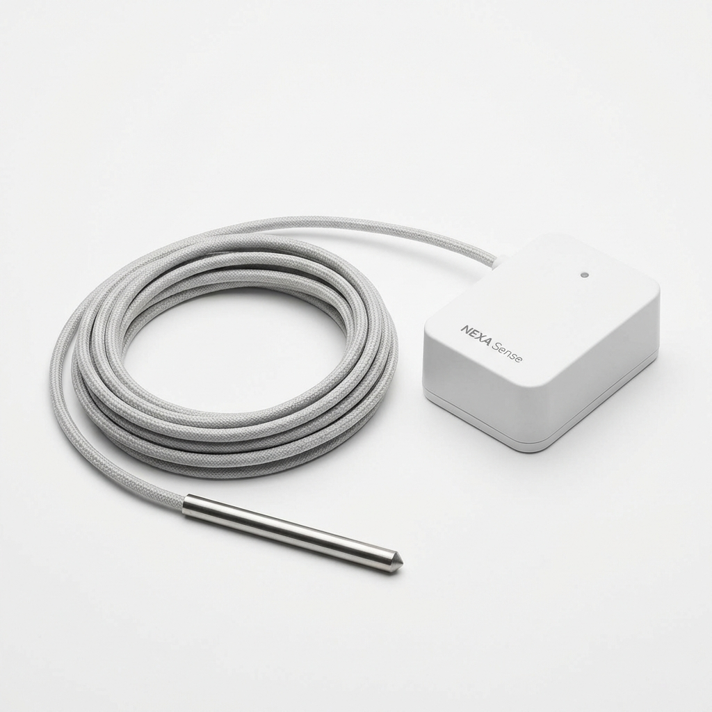
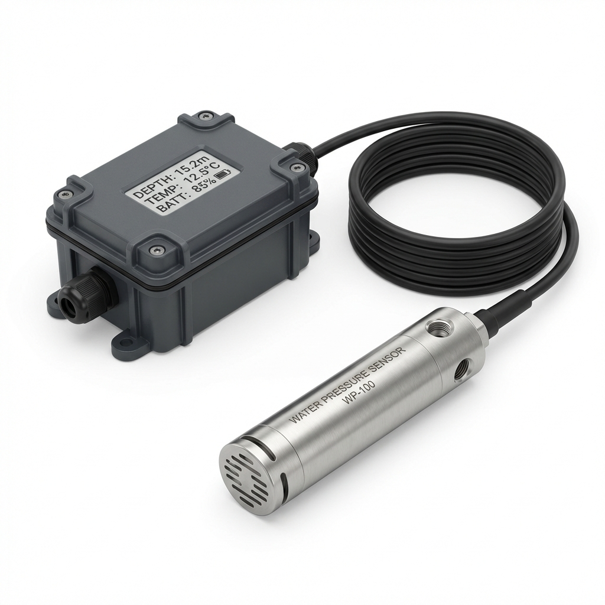
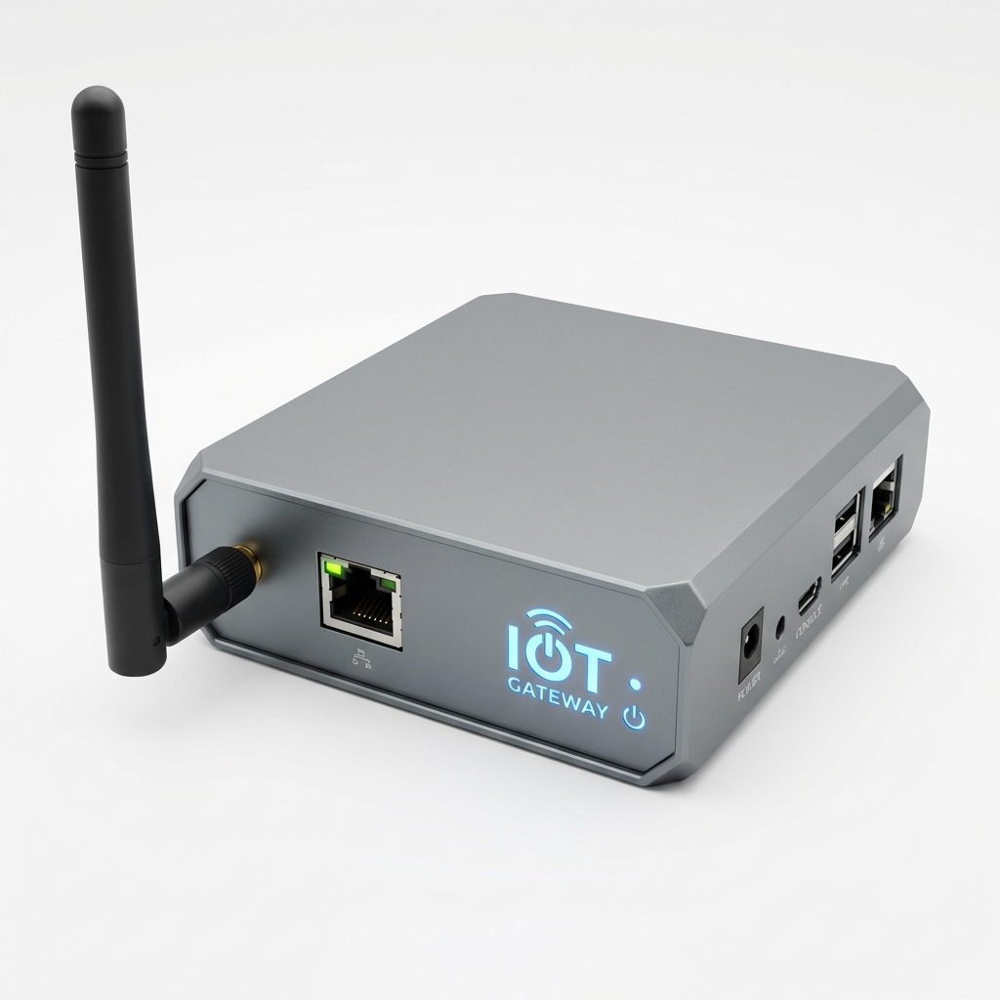

# IOT Sensor Network

A comprehensive suite of IOT sensor nodes designed for agricultural and industrial monitoring. Built on the **ARM (STM32)** architecture and utilizing **BME280** sensors, these nodes communicate via a meshed UART JSON protocol.

## System Architecture

All nodes (except the Gateway) share a common base architecture:
- **Environment**: Bosch BME280 (Temp, Humidity, Pressure)
- **Messaging**: Standardized JSON over UART (115200 baud)
- **Power**: Optimized for battery and low-power mesh operation

## Hardware Visuals

| Weather Station (RainMe) | Trough Monitor (TroughMe) | Dam Monitor (DamMe) |
|:---:|:---:|:---:|
|  |  |  |
| **Fridge Monitor (FridgeMe)** | **Water Level (TankMe)** | **Mesh Gateway (GatewayMe)** |
|  |  |  |
| **Mesh Module Block** | | |
|  | | |

## Sensor Catalog

### [DamMe](./src/DamMe)
Non-contact water level monitoring for dams and open water using ultrasonic ranging.

### [FenceMe](./src/FenceMe)
Safety-critical monitoring for electric fences up to 12kV. Includes local LED alert.

### [FridgeMe](./src/FridgeMe)
Dual-zone monitoring for cold storage, featuring an external temperature probe.

### [GateMe](./src/GateMe)
Real-time security and operational status for gates and doors.

### [GatewayMe](./GatewayMe)
The primary bridge between the local mesh network and the internet. Features **Modular Connectivity** options:
- **[Integrated Ethernet](./GatewayMe/Ethernet)**: Waveshare UART TO ETH (S2E) for transparent bridging.
- **[Swappable NB-IoT](./GatewayMe/NB-IoT)**: SIM7000 module for cellular backhaul.
- **[Swappable LoRaWAN](./GatewayMe/LoRaWAN)**: Rak811 module for long-range WAN.

### [Mesh Network](./Mesh)
The low-power, long-range LoRa communication backbone for all sensor nodes.

### [MoistureMe](./src/MoistureMe)
Professional SDI-12 soil monitor for multi-depth moisture and temperature profiling.

### [RainMe](./src/RainMe)
Weather station node monitoring rainfall, wind speed/gust, and wind direction.

### [SwitchMe](./src/SwitchMe)
Remote-controlled logic output for activating external equipment.

### [TankMe](./src/TankMe)
Monitors water levels in large tanks (0-10m) using hydrostatic pressure sensing.

### [TempMe](./src/TempMe)
The base environmental node and mesh repeater. Measures temperature, humidity, pressure, and altitude.

### [TroughMe](./src/TroughMe)
Precision low-range monitoring (0-1.5m) for livestock drinking troughs.

### [ValveMe](./src/ValveMe)
Automated flow control for 12VDC solenoid valves.

---
*Developed with PlatformIO for professional ARM-based embedded development.*
