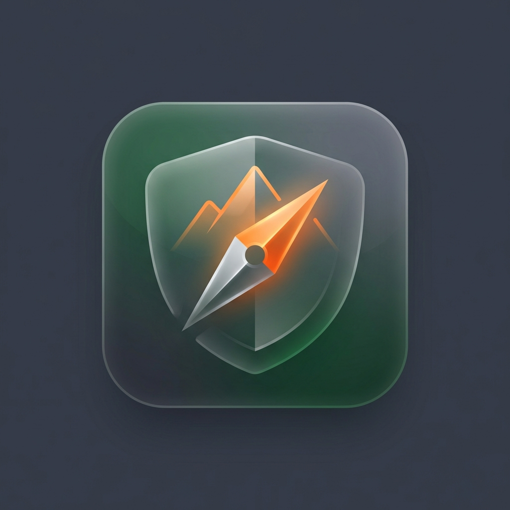
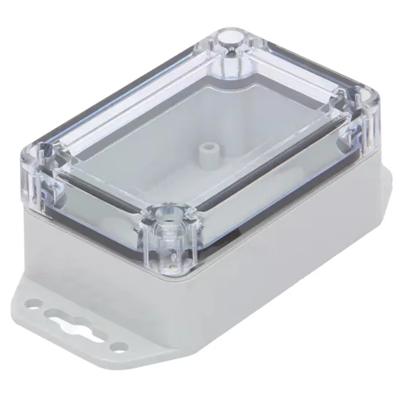

# IOT Sensor Network

A comprehensive suite of IOT sensor nodes designed for agricultural and industrial monitoring. Built on the **ARM (STM32)** architecture and utilizing **BME280** sensors as base, these nodes communicate via a meshed UART JSON protocol.

## System Architecture

All nodes (except the Gateway) share a common base architecture:

- **Environment**: Bosch BME280 (Temp, Humidity, Pressure)
- **Messaging**: Standardized JSON over UART (115200 baud)
- **Power**: Optimized for battery and low-power mesh operation

## Sensor Catalog

### [DamMe](./src/DamMe)

Non-contact water level monitoring for dams and open water using ultrasonic ranging.

### [FenceMe](./src/FenceMe)

Safety-critical monitoring for electric fences up to 12kV. Includes local LED alert.

### [ForestRanger](./scr/ForestRanger)

Forest monitoring for wildfire detection and illegal logging and activities via ML on the edge.

### [FridgeMe](./src/FridgeMe)

Dual-zone monitoring for cold storage, featuring an external temperature probe.

### [GateMe](./src/GateMe)

Real-time security and operational status for gates and doors.

### [GatewayMe](./GatewayMe)

The primary bridge between the local mesh network and the internet. Features **Modular Connectivity** options:

- **[Integrated Ethernet](./GatewayMe/Ethernet)**: Waveshare UART TO ETH (S2E) for transparent bridging.
- **[Swappable NB-IoT](./GatewayMe/NB-IoT)**: SIM7000 module for cellular backhaul.
- **[Swappable LoRaWAN](./GatewayMe/LoRaWAN)**: Rak811 module for long-range WAN.

### [Mesh Network](./Mesh)

The low-power, long-range LoRa communication backbone for all sensor nodes.

### [MoistureMe](./src/MoistureMe)

Professional SDI-12 soil monitor for multi-depth moisture and temperature profiling.

### [RainMe](./src/RainMe)

Weather station node monitoring rainfall, wind speed/gust, and wind direction.

### [SwitchMe](./src/SwitchMe)

Remote-controlled logic output for activating external equipment.

### [TankMe](./src/TankMe)

Monitors water levels in large tanks (0-10m) using hydrostatic pressure sensing.

### [TempMe](./src/TempMe)

The base environmental node and mesh repeater. Measures temperature, humidity, pressure, and altitude.

### [TroughMe](./src/TroughMe)

Precision low-range monitoring (0-1.5m) for livestock drinking troughs.

### [ValveMe](./src/ValveMe)

Automated flow control for 12VDC solenoid valves.

### [SiloMe](./src/SiloMe)

Monitors levels in silos (0-15m) using ultrasonic rangefinder.

## Sensor Data Encoding

All sensor data is encoded in a compact binary format and sent over the mesh network.

**Byte 1 is always the Sensor Type**. The remaining bytes are the sensor-specific data payload.

| Sensor Type | Byte 1 Value |
| ----------- | ------------ |
| TempMe      | 0            |
| DamMe       | 1            |
| FenceME     | 2            |
| ForesRanger | 3            |
| FridgeMe    | 4            |
| GateMe      | 5            |
| MoistureMe  | 6            |
| RainMe      | 7            |
| SwitchMe    | 8            |
| TankMe      | 9            |
| TroughMe    | 10           |
| ValveMe     | 11           |
| SiloMe      | 12           |

---

**Common Data Types:**

- Temperature: `int8_t` (raw data, ranges from -128 to 127°C)
- Humidity: `uint8_t` (0-100%)
- Pressure: `uint16_t` (hPa, e.g., 1013)
- Soil Temp: `int16_t` (centi-degrees, e.g., 2550 = 25.50°C)
- Rainfall: `uint32_t` (total count of tips)
- Distance: `uint16_t` (mm)
- Voltage/kV: `uint16_t` (kV \* 100)

**TempMe (7 bytes total)**

| Byte 1 | Byte 2 | Byte 3 | Byte 4-5 |
|---|---|---|---|---|
| Type | Air Temp | Humidity | Pressure |

**DamMe (7 bytes total)**

| Byte 1 | Byte 2 | Byte 3 | Byte 4-5 | Byte 6-7 |
|---|---|---|---|---|
| Type | Air Temp | Humidity | Pressure | Water Distance|

**FenceMe (7 bytes total)**

| Byte 1 | Byte 2 | Byte 3 | Byte 4-5 | Byte 6-7 |
|---|---|---|---|---|
| Type | Air Temp | Humidity | Pressure | Fence Voltage|

**ForestRanger**

| Byte 1 | Byte 2 | Byte 3 | Byte 4-5 | Byte 6 |
|---|---|---|---|---|
 Type | Air Temp | Humidity | Pressure | |

**FridgeMe (6 bytes total)**

| Byte 1 | Byte 2 | Byte 3 | Byte 4-5 | Byte 6 |
|---|---|---|---|---|
| Type | Air Temp | Humidity | Pressure | Fridge Temp|

**GateMe (6 bytes total)**

| Byte 1 | Byte 2 | Byte 3 | Byte 4-5 | Byte 6 |
|---|---|---|---|---|
| Type | Air Temp | Humidity | Pressure | Gate Status (1=Open)|

**MoistureMe (17 bytes total)**

| Byte 1 | Byte 2 | Byte 3 | Byte 4-5 | Byte 6-13 | Byte 14-17 |
|---|---|---|---|---|---|
| Type | Air Temp | Humidity | Pressure | Soil Temp 1-4 | Moisture 1-4 |

**RainMe (12 bytes total)**

| Byte 1 | Byte 2 | Byte 3 | Byte 4-5 | Byte 6-9 | Byte 10 | Byte 11 | Byte 12 |
|---|---|---|---|---|---|---|---|
| Type | Air Temp | Humidity | Pressure | Rainfall (uint32) | Wind Speed | Wind Gust | Wind Dir|

**SwitchMe (6 bytes total)**

| Byte 1 | Byte 2 | Byte 3 | Byte 4-5 | Byte 6 |
|---|---|---|---|---|
| Type | Air Temp | Humidity | Pressure | Switch Status (1=On)|

**TankMe (7 bytes total)**

| Byte 1 | Byte 2 | Byte 3 | Byte 4-5 | Byte 6-7 |
|---|---|---|---|---|
| Type | Air Temp | Humidity | Pressure | Tank Level (mm)|

**TroughMe (7 bytes total)**

| Byte 1 | Byte 2 | Byte 3 | Byte 4-5 | Byte 6-7 |
|---|---|---|---|---|
| Type | Air Temp | Humidity | Pressure | Water Level (mm)|

**ValveMe (6 bytes total)**

| Byte 1 | Byte 2 | Byte 3 | Byte 4-5 | Byte 6 |
|---|---|---|---|---|
| Type | Air Temp | Humidity | Pressure | Valve Status (1=Open)|

**SiloMe (7 bytes total)**

| Byte 1 | Byte 2 | Byte 3 | Byte 4-5 | Byte 6-7 |
|---|---|---|---|---|
| Type | Air Temp (int8) | Humidity (uint8) | Pressure (uint16) | Dist m (uint16)|

---

_Developed with PlatformIO for professional ARM-based embedded development._

## License

This project is proprietary and confidential. All Rights Reserved. See the [LICENSE](LICENSE) file for details.
