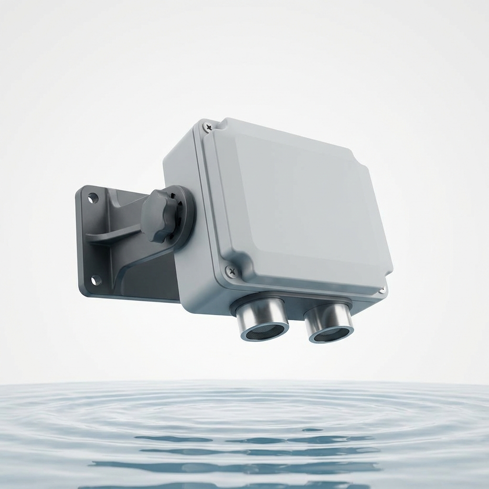

# DamMe - Dam & Water Level Monitor (Ultrasonic)

A non-contact water level monitoring solution designed for dams, reservoirs, or open containers.

## Overview
DamMe utilizes high-frequency sound waves to measure the distance to the water surface. This non-contact method is ideal for environments where sensors cannot be easily submerged or where water debris might interfere with contact sensors.



## Hardware Specifications
- **MCU**: ARM
- **Environment Sensor**: BME280 (I2C 0x76)
- **Level Sensor**: HC-SR04 or similar Ultrasonic Sensor
- **Trigger Pin**: GPIO 5
- **Echo Pin**: GPIO 6
- **Max Range**: 400 cm (4 meters)

## JSON UART Protocol
```json
{
  "id": "DAM01",
  "type": "DamMe",
  "t_c": 20.50,
  "h_pct": 65.20,
  "p_hpa": 1009.25,
  "dist_cm": 150.40
}
```

## Features
- **Non-Contact Sensing**: High reliability in varying water quality conditions.
- **Air Density Compensation**: Uses BME280 temperature data to calibrate the speed of sound for higher accuracy.
- **Dual Monitoring**: Tracks both water distance and ambient environmental metrics.
- **Rugged Design**: Optimized for outdoor deployment near open water bodies.
