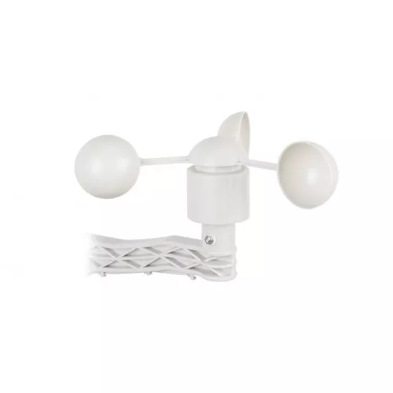

# RainMe - Weather Station Node

A comprehensive monitoring station for rainfall, wind speed, wind gust, and wind direction.

## Overview
RainMe transforms the standard environmental monitor into a high-performance weather station. It tracks precipitation via a tipping bucket mechanism and manages a full anemometer and wind vane set for atmospheric kinetic data.

## Hardware Specifications
- **MCU**: ARM
- **Environment Sensor**: BME280 (I2C 0x76)
- **Rain Sensor**: Tipping Bucket (Pin **GPIO 3**)
- **Anemometer**: Wind Speed Pulse (Pin **GPIO 14**)
- **Wind Vane**: Directional Analog (Pin **A3**)
- **Interface**: Interrupts (Rain/Wind), Analog (Direction)

## Binary Data Payload

**Sensor Type ID:** 8

| Byte 1 | Byte 2 | Byte 3 | Byte 4-5 | Byte 6-9 | Byte 10 | Byte 11 | Byte 12 |
|---|---|---|---|---|---|---|---|
| Type (8) | Air Temp (int8) | Humidity (uint8) | Pressure (uint16) | Rain Tips (uint32) | Wind Spd (uint8) | Gust (uint8) | Dir (uint8)|

## Features
- **Precise Wind Tracking**: Uses dedicated interrupts to capture high-speed wind pulses.
- **Gust Analysis**: Calculates the relative peak wind intensity within each 60-second window.
- **Directional Profile**: 0-359° directional mapping for wind vector analysis.
- **Rain Profiling**: Interrupt-driven pulse counting for accurate, cumulative precipitation tracking (running total mm).
- **Environment Fusion**: Combines humidity, pressure, and temperature to provide a holistic weather forecast profile.
